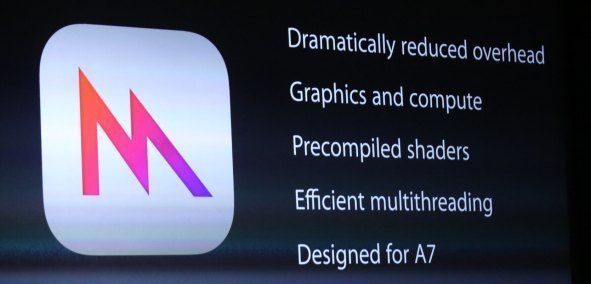
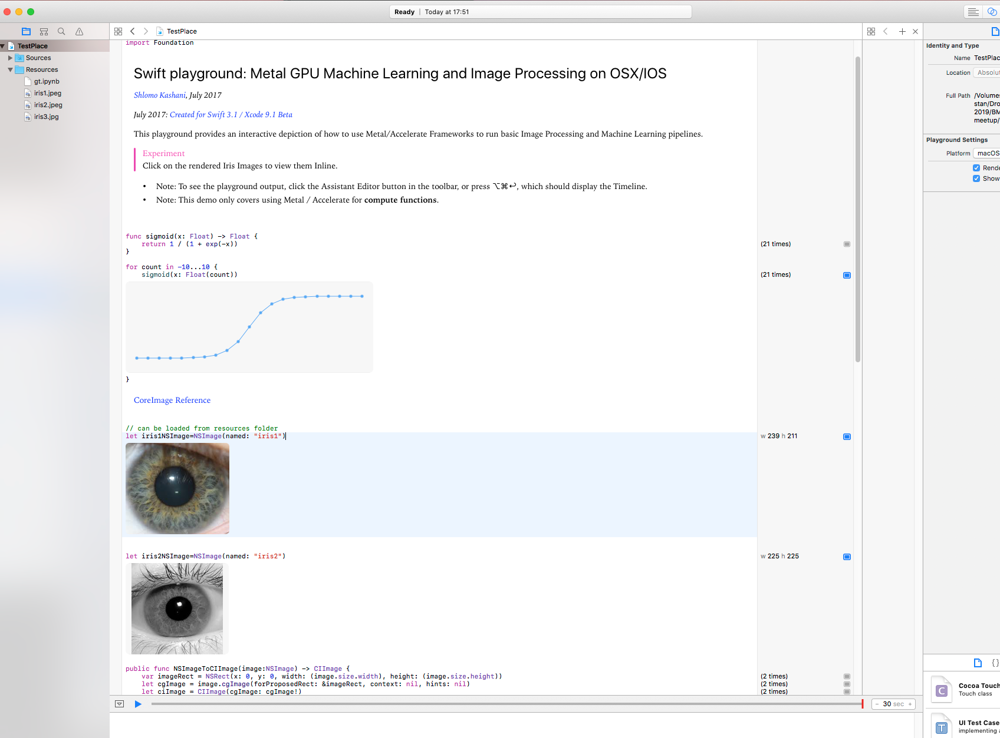

# GPUSwiftKaggler: A swift based library for IOS/OSX GPU based Machine and Deep Learning for Kaggle.



## Introduction

**GPUSwiftKaggler** contains Apple playgrounds and full Xcode projects for running compute kernels on an apple GPU instance targeting mostly *Kaggle competitions*. Many frameworks have been incorporated into this library to make it easier to get you going.  
**AFAIK, GPUSwiftKaggler is the first Swift based library for Kaggle.** 

## Motivation 
**Dreaming about writing an ML based app for the iPhone?** Want to get your hands dirty in a Kaggle competition? Want to use the GPU with Metal? 
You are in the right place. 

## Bakground 
**Apple's Metal** is a low-level, low-overhead hardware-accelerated graphics API that debuted in iOS 8. Apple states that Metal "lets developers create highly immersive console-style games on iPhone. Metal is optimized to allow the CPU and GPU to work together to deliver detailed graphics and complex visual effects." 

Apple had also recently presented a native machine learning (**CoreML**) and machine vision (**Vision**) frameworks augmenting the already existing libraries they provided (e.g, Accelerate). This significantly enhances the vast array of ML based apps that can be deployed to IOS based devices.



## Requirements
*Note: To use this library you need Xcode 8 and an iOS 10-compatible device (or latest Mac OSX) with at least an A8 processor.*
Stack:

• The GPU
• CoreML
• Accelerate
• MPSCNN
• Metal Performance Shaders
• CNN
• Metal
• Swift
• iOS 11.0 Beta
• Xcode 9+ Beta


## Usage

To set up your mac for using Metal on a GPU instance, run these commands:

```sh
```

To run a Playground:
```sh

```

To run an Xcode project:

```sh
```

## Maintainer

Shlomo Kashani ([shlomo@deep-ml.com](http://deep-ml.com))


## Credits


